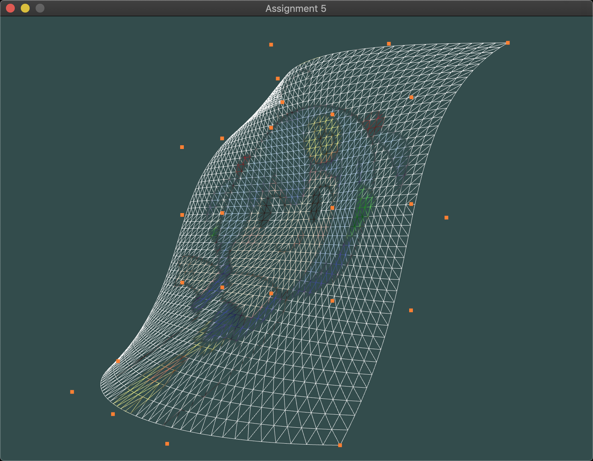

# FCG - HW5



## Dependencies

OpenGL (3.3+), GLAD, GLFW3, SOIL, GLM.

## How to build?

Make sure you installed all the dependencies. To build and run, execute the following commands.

```
$ g++ --std=c++11 -lglfw3 -lglad -lsoil -Wall -O3 -o main main.cpp
$ ./main
```

## Tested on

```
Apple LLVM version 10.0.1 (clang-1001.0.46.3)
Target: x86_64-apple-darwin18.5.0
```

## Notes

The basic framework (`camera.h`, `shader.h`, and some parts of `main.cpp`) were provided by the TAs.